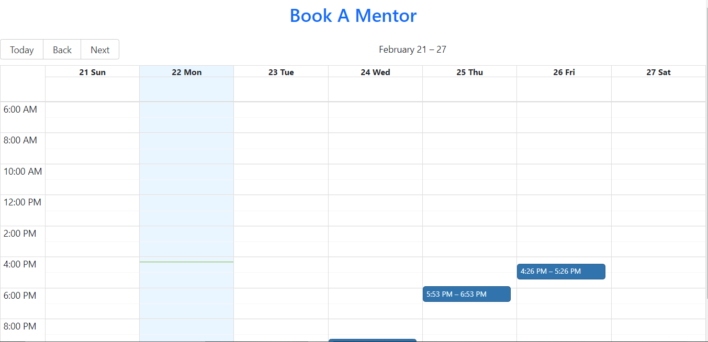
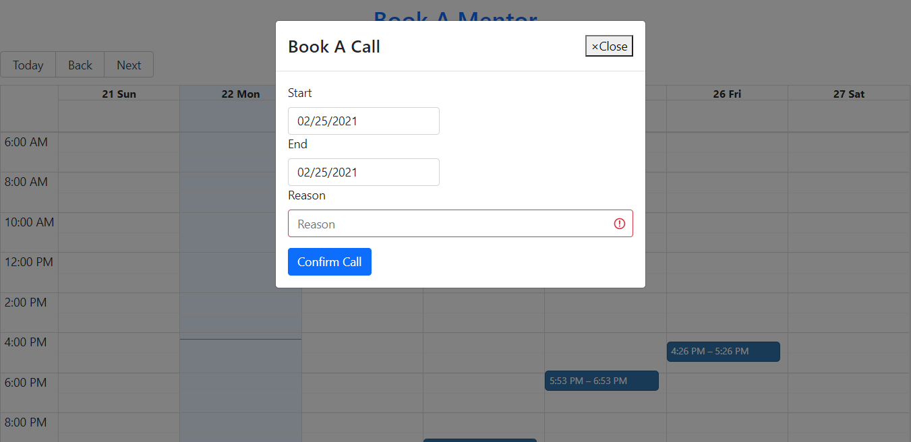

# Book-Mentor

> A calendar scheduler application for booking a meeting(call) with a mentor..

## User stories

As a student
I want to book a call with my mentor
So that I can have a mentoring session during my course

[API documentation](https://cfcalendar.docs.apiary.io/)

### Scenario 1:

Given I'm in the calendar page
When I click on a date
Then I see all the time slots containing the available and already allocated call sessions

### Scenario 2:

Given I have chosen a date on the calendar page
When I click on a free time slot
Then I see a field where I type the reason for the call
And I click on the button Confirm Call
Then I see a confirmation message with the date, time, and reason for my call

### Scenario 3:

Given I have chosen a date in the calendar page
When I click on a time slot that has already been allocated to a call Then I see an error message about the allocated slot

## Built With

- ReactJS
- React Big Calendar
- React-Boostrap
- Node/Express and Mongoose- For persisting booking to a db.

## Live Demo

[Heroku App Link](https://mentor-booking.herokuapp.com)

## screenshots

### Homepage



### Modal



## Getting Started

To get a local copy up and running follow these steps:

### Usage

- Fork/Clone this project to your local machine
- Open folder in your local enviroment and run these lines of code to get started:

Install gems with:

```React
    npm install
```

then run

```React
  npm start
```

Then open a web page and go to [port 3000 on your local machine.](http://localhost:3000)

### Deployment

The application was deployed on heroku.
To deploy your own copy, you can follow the following [steps:](https://devcenter.heroku.com/articles/git)

## Authors

👤 **Evanson Igiri**

## 🤝 Contributing

Contributions and feature requests are welcome!

Start by:

- Forking the project
- Cloning the project to your local machine
- `cd` into the project directory
- Run `git checkout -b your-branch-name`
- Make your contributions
- Push your branch up to your forked repository
- Open a Pull Request with a detailed description to the development(or master if not available) branch of the original project for a review

## Show your support

Give a ⭐️ if you like this project!
